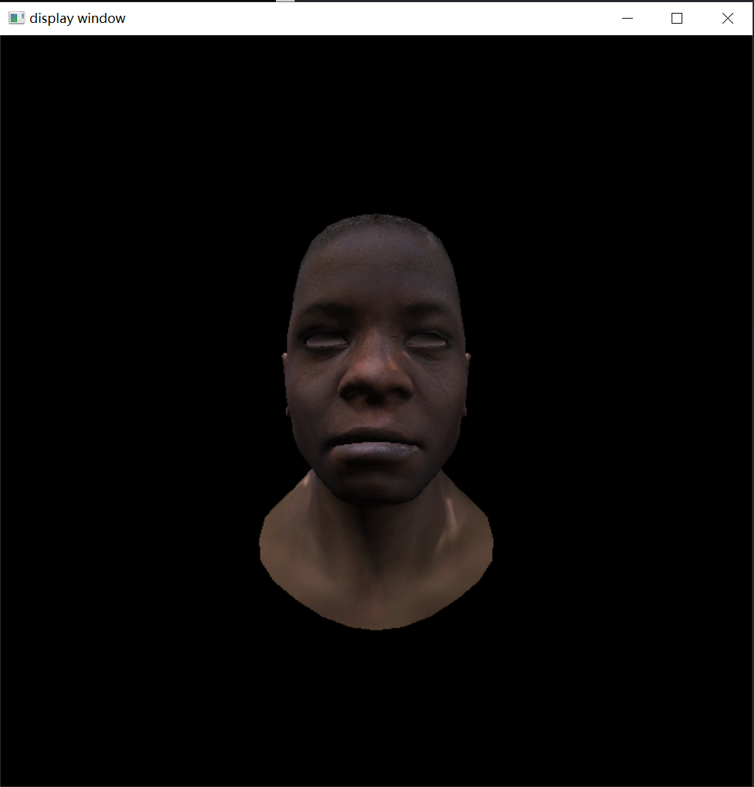

### TinyRasterizer

实现一个基于CPU的软光栅渲染器。

主要实现的内容：

1. 线段绘制

2. 图形渲染管线

3. texture mapping

4. Blinn phong reflectance model

5. normal mapping

----

### 一、图像操作

[image processing](markdown_files/image_processing.md)

-----

### 二、line drawing ： mid point algorithm

[mid point algorithm](markdown_files/mid_point_algorithm.md)

----

### 三、模型读取 && 投影

### 正交投影：

[orthographics projection](markdown_files/orthographic_projection.md)

### 透视投影：

[perspective projection](markdown_files/perspective_projection.md)

------

### 四、图形渲染管线

[graphics pipeline](markdown_files/graphics_pipeline.md)

----

### 五、Blinn Phong Reflectance Model

[Blinn Phong Reflectance Model](markdown_files/Blinn_Phong_Reflectance_Model.md)

----

### 六、normal mapping

[normal mapping](./markdown_files/normal_mapping.md)
