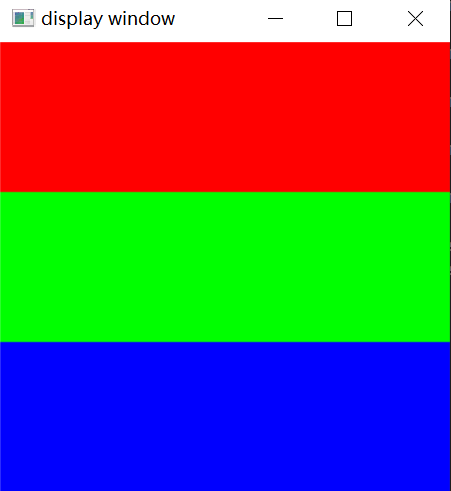
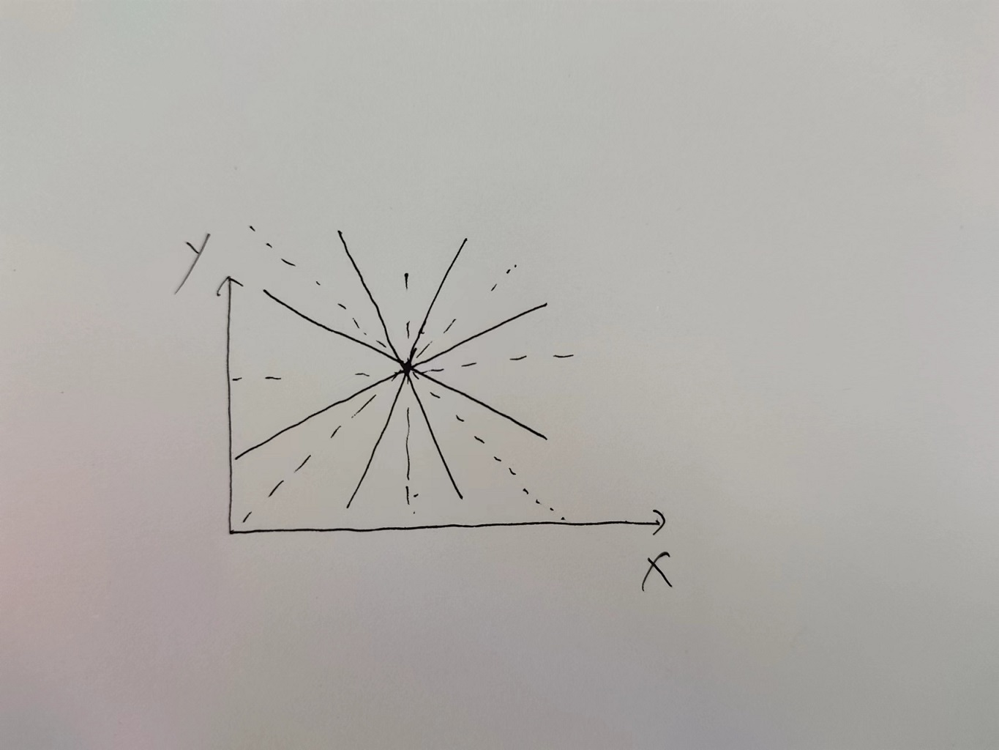
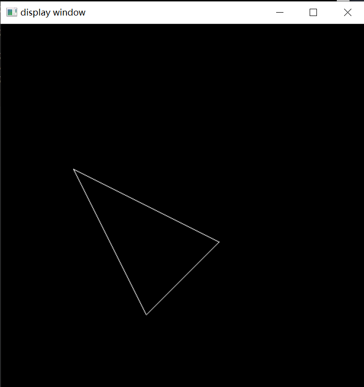
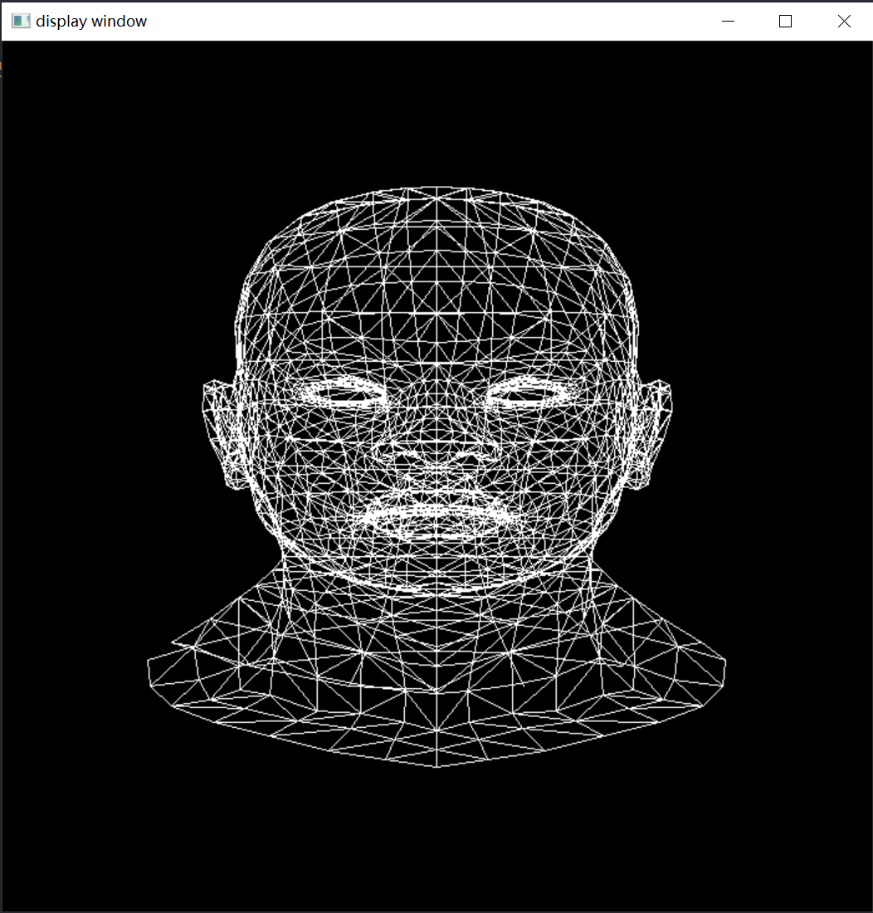
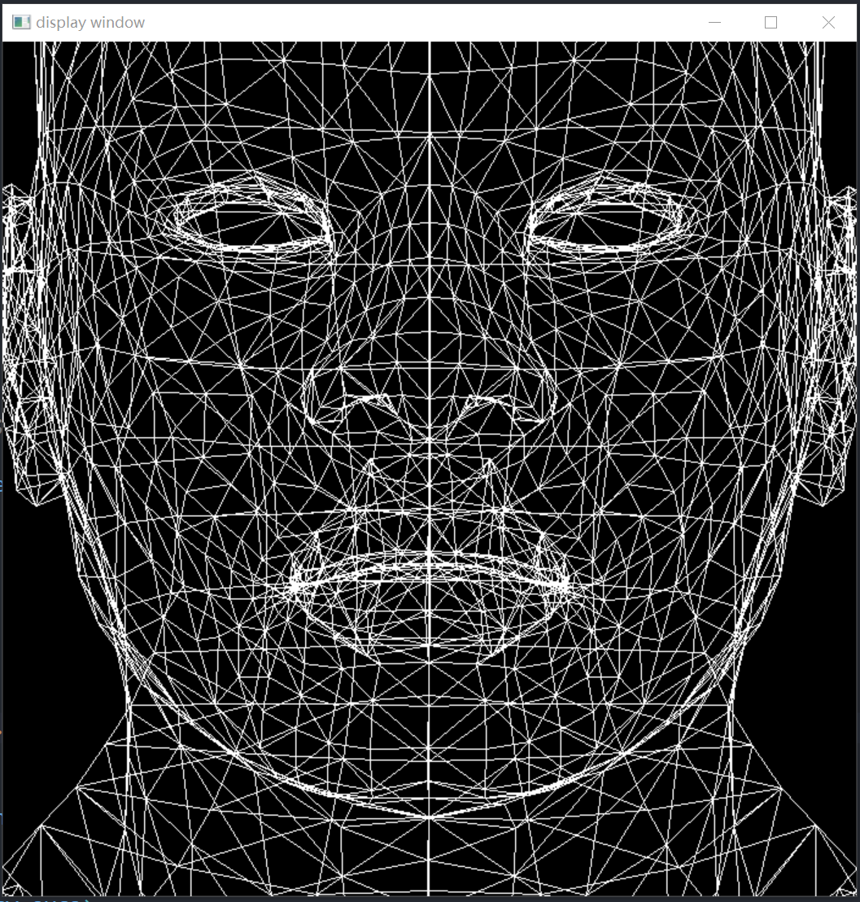
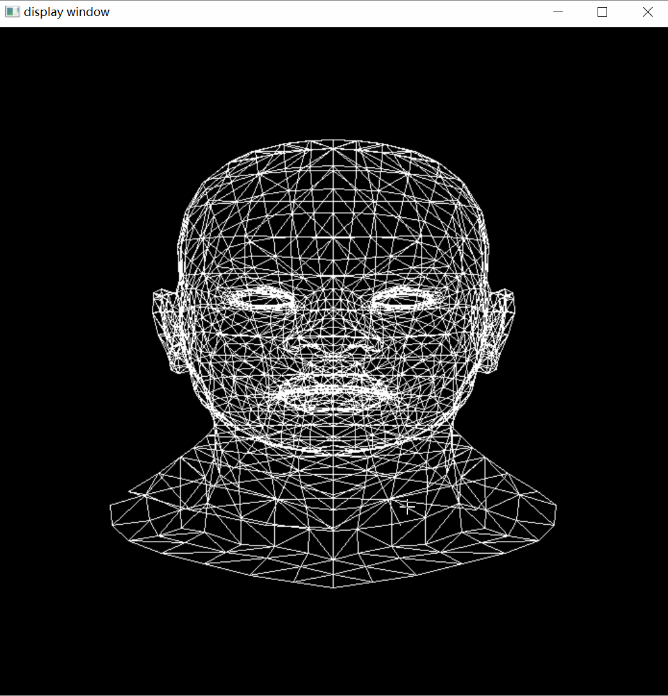

### TinyRasterizer

实现一个基于CPU的软光栅渲染器。

----

### 一、图像操作

光栅化的过程中涉及到大量的矩阵操作以及将像素转换为图片的操作。对于矩阵运算，采用Eigen矩阵运算库，图像操作采用opencv;

```cpp
//This function is used to convert the pixels' rgb value into opencv::Mat
void write_Mat(cv::Mat& img, std::vector<Eigen::Vector3f>& frame_buf)
{
    int channels = img.channels(), rows = img.rows, cols = img.cols * channels;

    //the Mat may be stored in a one dimension formation
    if (img.isContinuous())
    {
        cols = rows * cols;
        rows = 1;
    }

    uchar* p;
    int idx = 0;
    for (int i = 0; i < rows; ++i)
    {
        p = img.ptr<uchar>(i);
        for (int j = 0; j < cols; j += 3, idx += 1)
        {
            //the value in Mat is not RGB but BGR
            p[j] = frame_buf[idx].z();
            p[j + 1] = frame_buf[idx].y();
            p[j + 2] = frame_buf[idx].x();
        }
    }
}
```

例如对frame_buf中的数值初始化为1/3 red,1/3 blue and 1/3 green

```cpp
int step = height / 3;
    for (int i = 0; i < height; ++i)
    {
        for (int j = 0; j < width; ++j)
        {
            int idx = i * width + j;
            if (i < step)
                frame_buf[idx] = Eigen::Vector3f(255, 0, 0);
            else if (i < 2 * step)
                frame_buf[idx] = Eigen::Vector3f(0, 255, 0);
            else
                frame_buf[idx] = Eigen::Vector3f(0, 0, 255);

        }
    }
```

得到的结果就是：



----

### 二、line drawing ： mid point algorithm



如图所示，竖直和水平分开绘制之后一共有四种不同的斜率:(0,1],(1,inf),[-1,0),(-inf,-1)

实际上需要实现的是两种斜率的绘制，一个是(0,1]，一个是(1,inf)即可，并且给定的两个点的标准都是(x0,y0)  < (x1,y1),其余两种可以直接通过轴对称的方式实现计算。

期间省略一堆数学推导推理(可参考虎书)：

直线的方程为：

$$
f(x,y) = (y_0 - y_1)x + (x_1 - x_0)y + x_0y_1 - x_1y_0= 0
$$

对于斜率(0,1]的直线，it runs more than rises，也就是需要保证每个x都有一个数值！

```python
x = x0
y = y0
d = f(x0 + 1,y0 + 0.5)
for x in (x0,x1):
    setpixel(x,y)
    if (d < 0):
        d += (x1 - x0) + (y0 - y1)
        y += 1 
    else:
        d += (y0 - y1)
```

对于斜率为(1,inf)的直线，it rises more than runs，也就是需要保证每个y都要有一个数值！

```python
x = x0
y = y0
d = f(x0 + 0.5,y0 + 1)
for y in (y0,y1):
    setpixel(x,y)
    if(d < 0):
        d += (x1 - x0)
    else:
        x += 1
        d += (x1 - x0) + (y0 - y1)
```

what’s more ,opencv的图像的y轴是向下的，最后画出来的图像是上下颠倒的，比如y=x本来是斜向上的，结果出来是斜向下的。

也就是需要将frame_buf中的第一行写到opencv的mat中的最后一行，修改一下write_mat即可。

```cpp
//This function is used to convert the pixels' rgb value into opencv::Mat
void write_Mat(cv::Mat& img, std::vector<Eigen::Vector3f> frame_buf)
{
    int channels = img.channels(), rows = img.rows, cols = img.cols * channels;

    //the Mat may be stored in a one dimension formation
    //if (img.isContinuous())
    //{
    //    cols = rows * cols;
    //    rows = 1;
    //}

    uchar* p;
    int idx = 0;
    for (int i = rows - 1; i >= 0; --i)
    {
        p = img.ptr<uchar>(i);
        for (int j = 0; j < cols; j += 3, idx += 1)
        {
            //the value in Mat is not RGB but BGR
            p[j] = frame_buf[idx].z();
            p[j + 1] = frame_buf[idx].y();
            p[j + 2] = frame_buf[idx].x();
        }
    }
}
```

尝试绘制一个三角形：



有比较明显的走样。。。

----

### 三、模型读取 && 投影

参考了[ssloy/tinyrenderer: A brief computer graphics / rendering course (github.com)](https://github.com/ssloy/tinyrenderer)的模型读取方式，修改为Eigen的向量。

obj文件的格式：

```cpp
v -0.000581696 -0.734665 -0.623267
v 0.000283538 -1 0.286843

vt  0.532 0.923 0.000
vt  0.535 0.917 0.000

vn  0.400 0.338 0.852
vn  0.270 0.126 0.955
vn  0.357 0.433 0.828

f 24/1/24 25/2/25 26/3/26
f 24/1/24 26/3/26 23/4/23
f 28/5/28 29/6/29 30/7/30
```

v：顶点的xyz坐标

vt：纹理坐标

vn：顶点的法向量

f: 一个三角形的顶点index/纹理index/法向量index(从1开始)

**正交投影以及透视投影：之前一直不太理解view volume以及canonical view volume的意义，现在有了一些更加深刻的理解。view volume 实际上定义的是相机可以看到的world space 中的空间范围的大小，因为相机包括人眼实际上看到的范围空间是有限的，例如相机就是透视投影，可以看到的范围就是一个视锥体(通过远平面和近平面以及fov等等定义可视的视锥体的大小)，正交投影的范围是一个axis aligned bounding box，通过定义六个平面的参数确定。也就是world space 中的物体并不是都能够投影到二维平面上的，得在view volume 中的物体才能够被投影到二维平面上面。同时view volume是自定义的，也就是看到多少物体实际上是自定义的。**

为什么突然有感呢？刚刚尝试在写正交投影，简单啊，直接扔掉z坐标，留下xy坐标，但是xy坐标太小了，肯定不能作为screen space中的坐标，得做一个view port transformation,但是要做view port transformation得知道二维平面的大小以及screen的大小，xy坐标二维的大小呢？实际上就是自定义的，能够看到多少的范围。标准做法是：view volume -> canonical view volume -> view port transformation -> screen space.

实际上投影到canonical view volume也是为了方便对不在view volume空间中的三角形进行clipping，也被成为clipping space。

```cpp
模型边界取值范围：
-0.66248 0.66248
-1 1
-0.675105 0.675105
```

那orthographic view volume的定义可以是[-1,1] && [-1.5,1.5] && [-1,1]

$$
M_{otho} =
\begin{bmatrix}
\frac{2}{r-l} & 0 & 0 & 0 \\
0 & \frac{2}{t-b} & 0 & 0 \\
0 & 0 & \frac{2}{n-f} & 0\\
0 & 0 & 0 & 1\\
\end{bmatrix}
\times
\begin{bmatrix}
1 & 0 & 0 & -\frac{l+r}{2}\\
0 & 1 & 0 & -\frac{b + t}{2}\\
0 & 0 & 1 & -\frac{n + f}{2}\\
0 & 0 & 0 & 1 
\end{bmatrix}
$$

之后做view port transformation:将canonical view volume 转换为 screen space 中的坐标。[-1,-1] * [-1,1] -> [-0.5,width - 0.5] * [-0.5,height - 0.5],先放大后平移

$$
\begin{bmatrix}
x_{screen}\\
y_{screen}\\
1
\end{bmatrix} = 
\begin{bmatrix}
\frac{width}{2} & 0 & \frac{width-1}{2}\\
0 & \frac{height}{2} & \frac{height-1}{2}\\
0 & 0 & 1\\
\end{bmatrix}
\begin{bmatrix}
x_{canonical}\\
y_{canonical}\\
1
\end{bmatrix}
$$

通过正交投影可以生成的图像：



如果修改正交投影的view volume的大小，使得并不能够包围整个头像，也就是[-0.5,0.5] && [-0.5,-0.5] && [-0.5.0.5]，得到的结果是：



可以看到确实是不能看到整个模型了，只能看到部分模型，虽然模型上面的点是真实存在的并且也是通过正交变化以及view port transformation，不过并不在axis aligned abounding box中的线段经过变换之后会超过屏幕空间坐标的表示范围，也就是最后并不能被看到，因此将view volume理解为可视范围也是ok的。当然得对frame_buf做一个越界判断(直接修改view volume会导致vector越界)

通过model transformation 可以实现简单的绕y轴旋转：按键A和D控制。



### 正交投影：

[perspective projection](markdown_files/perspective_projection.md)
