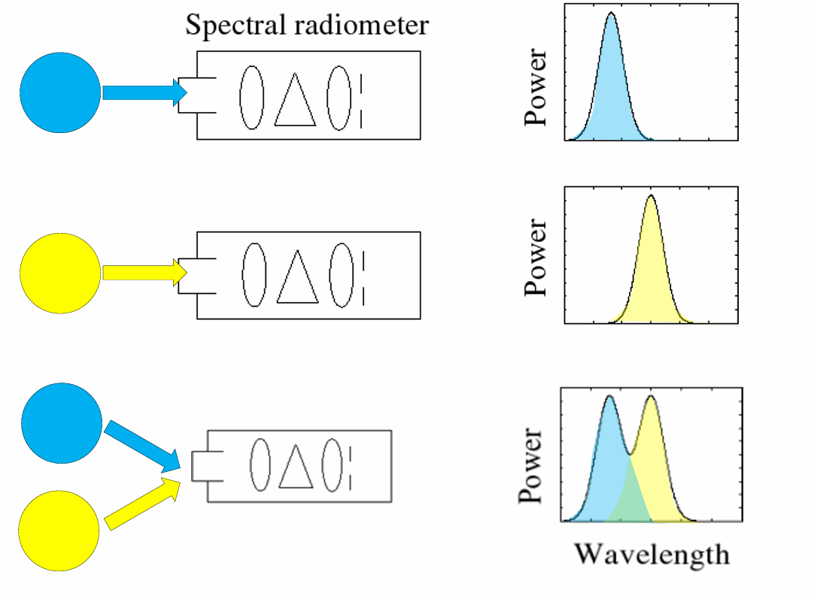

### Blinn Phong Reflectance Model

现实世界中，并不是只有物体的颜色，查找物体的颜色显示出来就行的。现实世界涉及光和物体表面材质的复杂作用。

Blinn Phong Reflectance Model考虑三种类型的的光：specular,diffuse and ambient

三种光线的推导可见games101.

diffuse light:

$$
I_d = k_d \times \frac{I}{r^2} \times max(0,l.dot(n))
$$

diffuse light 和 eye direction 是没有关系的，因为diffuse light是向各个方向均匀散射光线，也就是无论眼睛看向的方向无论是什么都一样(别在下面就行)，散射到各个方向的光照的大小是由漫散射系数kd决定的。

specular light:

$$
I_S = k_s\frac{I}{r^2}\times max(0,l.dot(n))\times max(0,(\frac{l + eye}{|l + eye|}.dot(n)^p))
$$

镜面放射自然是和眼睛看向的方向相关的，因为离光线反射的方向越近，看到的就越亮。

ambinet light:

$$
I_a=k_aI_a
$$

emm三种光线的推导实际上很简单。一直困惑我的是实现细节上的一些问题。

两个困惑：

众所周知，人之所以能看到物体的颜色是因为光进入到人的眼睛，也就是实际上看到一个shading point显示的最终颜色也就是那个shading point反射的进入人的眼睛的光线的颜色。那个点反射的进入人眼的光线是白色，那么该shading point 就是白色；如果进入人的眼睛的光线是绿色，自然该shading point的颜色就是绿色。

那么很自然，光线应该使用RGB三维表示，最后才能确定光的颜色。

还有一个问题就是，上面的公式只是说了光线在不同表面反射出去的强度，比如镜面反射，漫反射等等，这个是物体表面材料的性质：究竟是全反射还是漫反射还是折射啊等等。

但是我好奇的是白色的光打到绿色的shading point上面，反射出来的光应该是什么颜色？红色的光打到绿色的shading point上面，反射出来的光又应该是什么颜色，貌似都没有说明具体的物理定律和计算公式。但是感觉应该和吸收的光的强度相关，比如经常说黑色的物体吸收的光强多，绿色的物体只能反射绿色，吸收其他颜色。

---

现代图形学入门(bushi)现代光学和现代生物学入门(参考games101和[图形渲染基础：光与颜色 - 知乎 (zhihu.com)](https://zhuanlan.zhihu.com/p/392935292))

光的颜色是混合之后的结果：棱镜分解和合成，白光->七种颜色的光->白光。

从光线是波动上来看，描述一种光实际上需要使用SPD(spectral power distribution)描述了光线在不同的波长上的强度分布(单位：watt/nm)。


SPD具有很好的性质：线性性质



1. color is human perception;it is not universial property of light

2. different wavelength is not colors

颜色并不是光线的性质，只是人类的感知。

人类感知光的颜色时通过三种不同的视锥细胞，三种不同的视锥细胞对不同波长的光具有不同的响应程度：


人和人之间的视锥细胞分布并不相同，也就是每个人都以相似但是完全不同的方式看待这个世界的颜色。

有了细胞对每个波长的响应强度，给定一个spd分布s的光，可以计算三个不同的数值：

$$
S = \int R_s(\lambda)s(\lambda)d(\lambda)\\
M = \int M_s(\lambda)s(\lambda)d(\lambda)\\
L = \int L_s(\lambda)s(\lambda)d(\lambda)\\
$$

大脑看到的只是SML的三个数值。（人眼可以自动积分，为什么我的脑子不会。。）

同色异谱现象：不同SPD最后可能拥有相同的SML，也就是最后呈现出来相同的颜色。

颜色匹配：

给定基础颜色的光谱

$$
S_R(\lambda)\\
S_G(\lambda)\\
S_B(\lambda)
$$

调整不同光谱的强度并相加：

$$
R\times S_R(\lambda) + G\times S_G(\lambda) + B \times S_B(\lambda)
$$

也就是颜色可以使用三个标量表示。

颜色匹配实验：使用三种单一波长的光去匹配另外一个单一波长的光（加性颜色）


最后得到一张响应图


那么给定spd的光，可以得到

$$
R = \int r(\lambda)s(\lambda)d(\lambda)\\
G = \int g(\lambda)s(\lambda)d(\lambda)\\
B = \int b(\lambda)s(\lambda)d(\lambda)\\
$$

运用三刺激颜色运算的物理意义：

1. 颜色的加法
   
   两个颜色的相加表示色光的叠加，也就是光通量的叠加，叠加越多，颜色就会越白。
   
   $$
   (R_1,G_1,B_1) + (R_2,G_2,B_2) = (R_1 + R_2,G_1 + G_2,B_1 + B_2)
   $$

2. 颜色的数乘
   
   表示k个相同的色光叠加
   
   $$
   k(R_1,G_1,B_1) = (kR_1,kG_1,kB_1)
   $$

3. 颜色的乘法
   
   可以认为是物体表面对光的吸收和反射能力，比如纯绿色的物体表示为(0,1,0),被白光(1,1,1)照射之后是(0,1,0)，也就是对红色和蓝色的吸收能力极强最后出来的是绿色的光。
   
   如果是红色的光(1,0,0)照射到绿色(0,1,0)物体上面，那么就是黑色的。光打到物体上面实际上就是颜色的乘法，遵从哈达玛积。
   
   $$
   (R_1,G_1,B_1) \times (R_2,G_2,B_2) = (R_1R_2,G_1G_2,B_1B_2)
   $$

因此在图形学中，计算物体的颜色就是通过：

$$
final\_color = light\_color \times texture\_color
$$

学习了，自己写的时候才认真考虑了光线和颜色的作用，自己之前一直只知道blinn phong reflectance model的三个公式。。。。

----

### 重新审视Blinn-Phong Reflectance Model

diffuse light:

$$
I_d = k_d \times \frac{I}{r^2} \times max(0,l.dot(n))
$$

specular light:

$$
I_S = k_s\frac{I}{r^2}\times max(0,l.dot(n))\times max(0,(\frac{l + eye}{|l + eye|}.dot(n)^p))
$$

ambinent:

$$
I_a=k_aI_a
$$

一般模型导出都会有两个描述文件,一个是obj文件，一个是mtl文件。

mtl 文件解析：

```python
# Blender MTL File: 'Crate1.blend'
# Material Count: 1

newmtl Material.001
Ns 96.078431
Ka 0.000000 0.000000 0.000000
Kd 0.640000 0.640000 0.640000
Ks 0.500000 0.500000 0.500000
Ni 1.000000
d 1.000000
illum 2
map_Kd wall1.tif
```

第一句：newmtl 材质名称描述了一个材质

ka kd ks就是phong model 的参数；

Ns描述了镜面的反光度

illum:光照模型(0,1,2)0恒色着照明模型，1漫反射照明模型，2漫反射和镜面光照环境光模型

map_Kd:材质贴图

emmm，读写具有多个不同材质的mtl和贴图还是蛮麻烦的，先实现一种材质和贴图的读取吧，偷懒一波。。。有点不太想写。。。以后补上。。。mtl读取也免了，肉眼读取写到代码里面。。。给自己挖个坑，最后完善的程序能够读取mtl和obj并且在图像的中央显示模型，可以鼠标拖动旋转。

```cpp
Eigen::Vector3f rasterizer::blinn_phong_reflectance_shader(fragment_shader_data* d)
{
    Eigen::Vector3f ka = Eigen::Vector3f(0.005, 0.005, 0.005);
    Eigen::Vector3f kd = Eigen::Vector3f(0.64, 0.64, 0.64);
    Eigen::Vector3f ks = Eigen::Vector3f(0.7937, 0.7937, 0.7937);

    auto l1 = light{ {20, 20, 20}, {1000, 1000, 1000} };
    auto l2 = light{ {-20, 20, 0}, {1000, 1000, 1000} };

    std::vector<light> lights = { l1, l2 };
    Eigen::Vector3f amb_light_intensity{ 10, 10, 10 };
    Eigen::Vector3f eye_pos{ 0, 0, 0 };

    float p = 150;

    Eigen::Vector3f color = d->t->get_color(d->uv.x(), d->uv.y()) / 255.f;
    Eigen::Vector3f point = d->camera_pos;
    Eigen::Vector3f normal = d->normal;

    Eigen::Vector3f result_color = { 0, 0, 0 };
    for (auto& light : lights)
    {


        Eigen::Vector3f light_direction = (light.position - point).normalized();
        Eigen::Vector3f view_direction = (eye_pos - point).normalized();

        auto r_2 = (light.position - point).squaredNorm();

        auto ambient_l = ka.cwiseProduct(amb_light_intensity);

        auto diffuse_l = kd.cwiseProduct(light.intensity / r_2) * std::max(0.0f, light_direction.dot(normal));

        auto h = (light_direction + view_direction).normalized();
        auto specular_l = ks.cwiseProduct(light.intensity / r_2) * std::pow(std::max(0.0f, h.dot(normal)), p);

        result_color += ambient_l + diffuse_l + specular_l;


    }

    Eigen::Vector3f result = { result_color.x() * color.x() * 255.f,result_color.y() * color.y() * 255.f,result_color.z() * color.z() * 255.f };

    return result;
}
```


可以看到有了光照之后确实不一样了，有的地方是有光泽的，看着更加真实，虽然系数都是我乱设的。

将光照强度加大两倍到1000：


