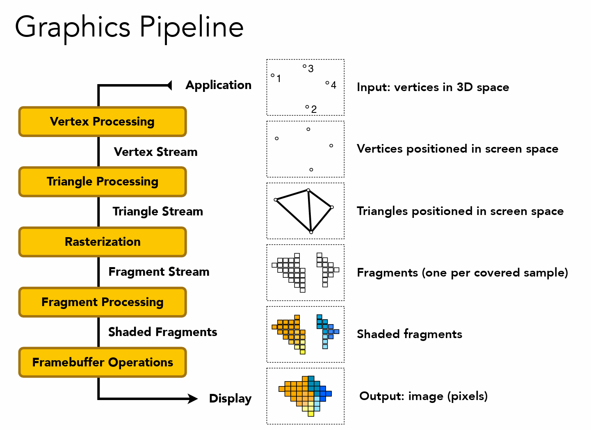

### graphics pipeline(real time rendering pipeline)



(图源：games101)

一个物体是如何通过图形渲染管线显示到屏幕上面的。实际上就是将物体上的每一个三角形面是如何显示在屏幕上面的。主要通过一个三角形面来走通整条图形渲染管线。

### 1. 三个顶点坐标首先通过vertx processing:

主要是model transformation ->  camera transformation -> perspective projection -> view port transformation 得到屏幕空间上的坐标。

(x,y,z,1) -> model transformation -> (x1,y1,z1,1) -> camera transformation -> (x2,y2,z2,1) -> squeezing -> (x3,y3,z3,w3) -> orthographics projection -> viewport transformation -> (x4,y4,z4,w4)

可以知道，在model transformation,camera transformation中都不会改变第四个坐标的分量，在suqeezing之后会改变第四个维度的分量的大小，从以下也可以看的出来：


也就是vertex processing 的处理过程为：

model transformation -> camera transformation -> squeezing -> /w -> orthographic projection -> viewport transformation

实际上可以将除以w的操作放到最后也是可以的。

model transformation -> camera transformation -> squeezing -> orthographics projection -> viewport transformation -> /w -> screen space;

### 2. triangle processing

屏幕空间中的三个点构成屏幕空间中的一个三角形

### 3. rasterization

通过采样将三角形离散化为screen space中的pixel也被称为fragment。

### 4. shader

给每一个像素进行着色的过程。

总结起来就是：

```python
for triangel in triangles :
    vertx1 = MVP_Viewport_transformation(vertex1) / w
    vertx2 = MVP_Viewport_transformation(vertex2) / w
    vertx3 = MVP_Viewport_transformation(vertex3) / w
    for pixels in the screen:
        if(pixels in the triangle):
            if(pixels is visible):
                color = shader()
        set_color(pixel,color)
```

**其中还是有相当多的细节问题需要考虑。**

### 1. 着色频率

1. flat shading : 对一整个三角形面的所有pixel进行着色，一整个三角形的法向量以及uv坐标

2. gouraud shading: 对三角形三个顶点进行着色，并对在三角形中的每一个像素颜色进行插值

3. phong shading: 对三角形内的每个像素进行着色

### 2. 判断是否可见 ：z buff

涉及到z坐标的远近比较。需要使用的是哪个空间中depth 作为判断的标准？最好的自然是使用world space 中的depth。can it work ? 一般是使用screen space 中三个顶点z值通过矫正插值得到，并且uv坐标以及法向量也是需要通过矫正插值(透视插值矫正可见虎书)得到。

### 3. 插值

通过重心坐标实现插值。

### 4. 判断点和三角形的关系

1. 三角和法

2. 叉积同向法

3. 重心法

### 5. 通过uv查找rgb value

找一张texture,然后读入为Mat,通过uv进行查找。emmm还得好好修改一下读model的程序来读取uv坐标以及法向量。。
