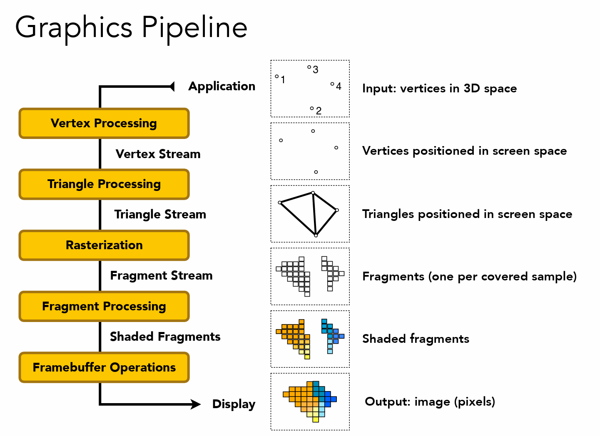
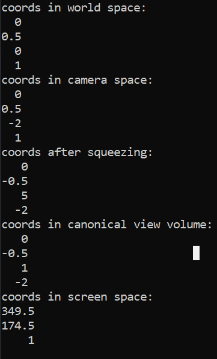
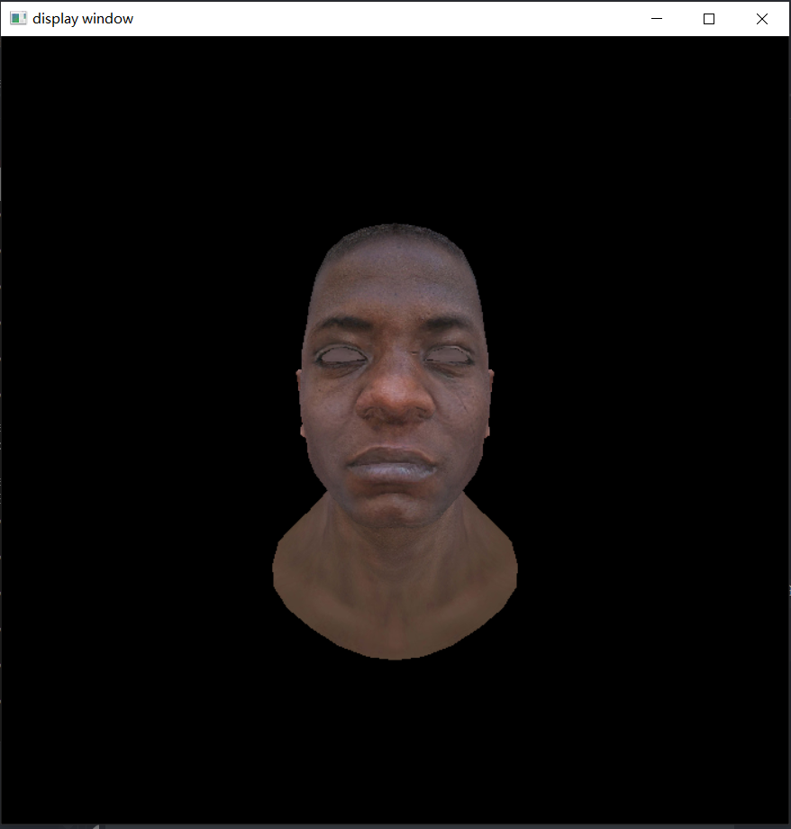
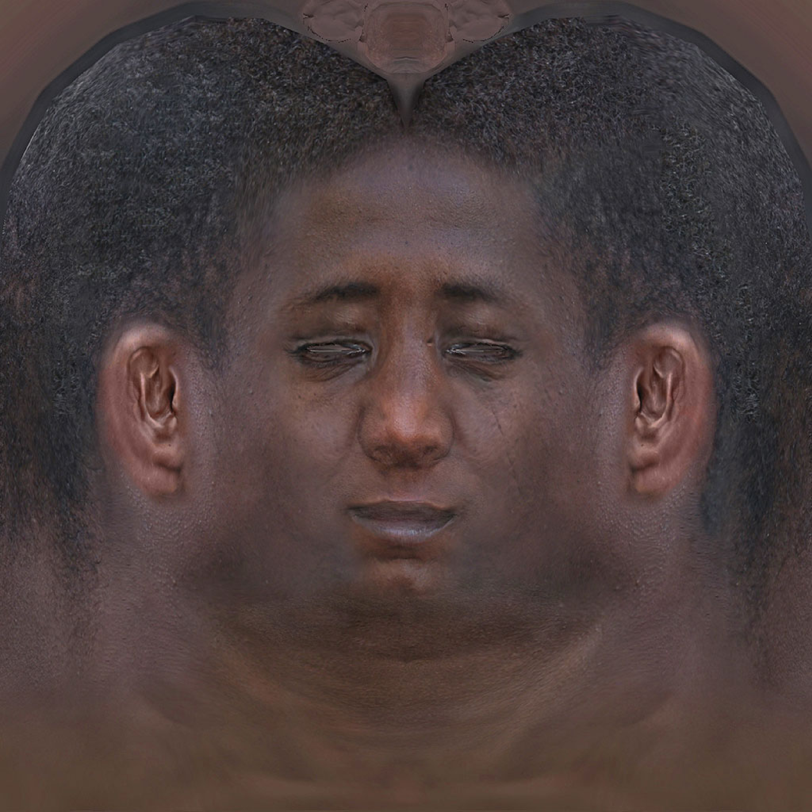
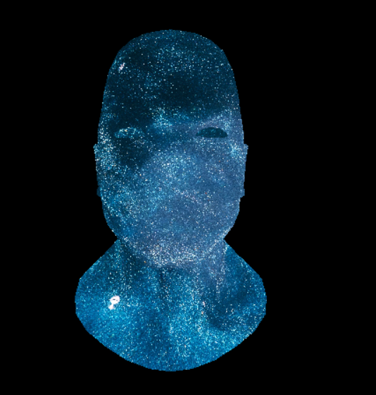
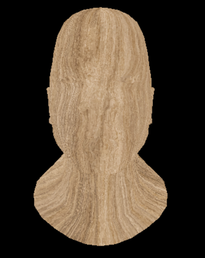
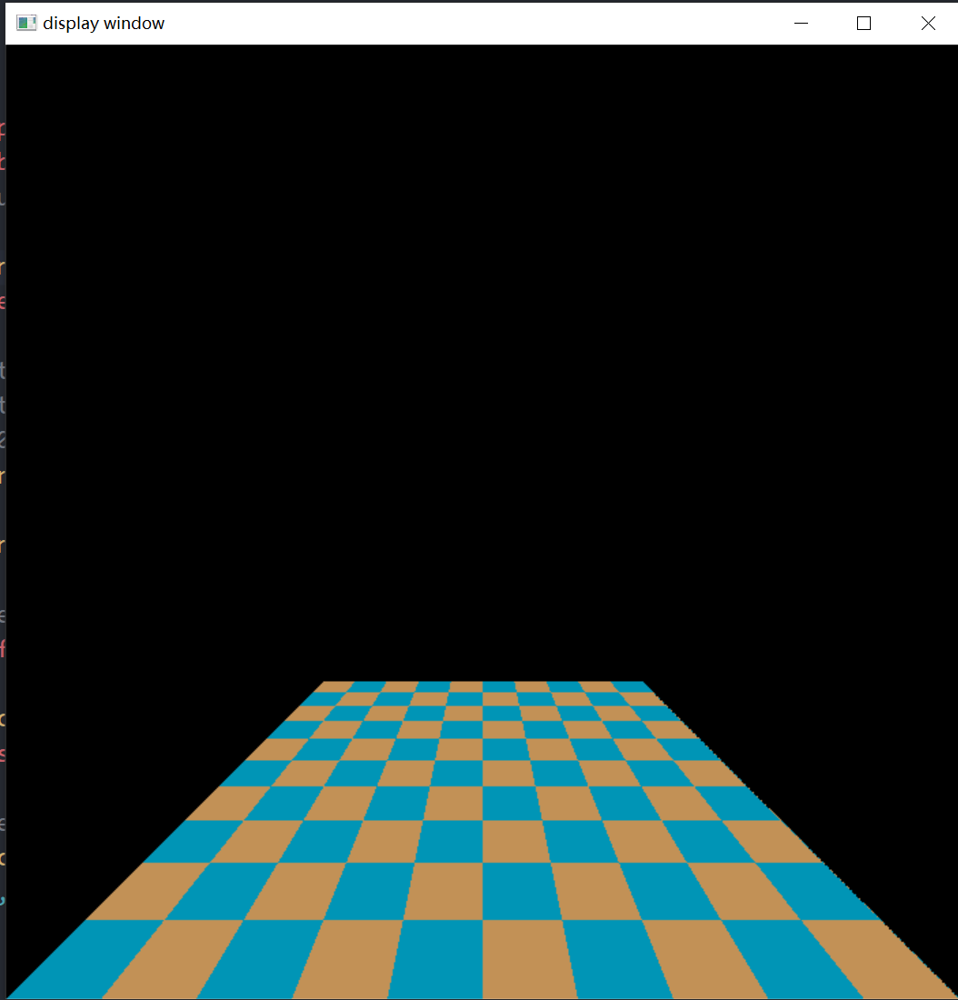

### graphics pipeline(real time rendering pipeline)



(图源：games101)

一个物体是如何通过图形渲染管线显示到屏幕上面的。实际上就是将物体上的每一个三角形面是如何显示在屏幕上面的。主要通过一个三角形面来走通整条图形渲染管线。

### 1. 三个顶点坐标首先通过vertx processing:

主要是model transformation ->  camera transformation -> perspective projection -> view port transformation 得到屏幕空间上的坐标。

(x,y,z,1) -> model transformation -> (x1,y1,z1,1) -> camera transformation -> (x2,y2,z2,1) -> squeezing -> (x3,y3,z3,w3) -> orthographics projection -> viewport transformation -> (x4,y4,z4,w4)

可以知道，在model transformation,camera transformation中都不会改变第四个坐标的分量，在suqeezing之后会改变第四个维度的分量的大小，从以下也可以看的出来：



也就是vertex processing 的处理过程为：

model transformation -> camera transformation -> squeezing -> (Homogeneous division)/w -> orthographic projection -> viewport transformation

实际上可以将除以w的操作放到最后也是可以的。

model transformation -> camera transformation -> squeezing -> orthographics projection -> viewport transformation -> /w -> screen space;

### 2. triangle processing

屏幕空间中的三个点构成屏幕空间中的一个三角形

### 3. rasterization

通过采样将三角形离散化为screen space中的pixel也被称为fragment。

### 4. shader

给每一个像素进行着色的过程。

总结起来就是：

```python
for triangel in triangles :
    vertx1 = MVP_Viewport_transformation(vertex1) / w
    vertx2 = MVP_Viewport_transformation(vertex2) / w
    vertx3 = MVP_Viewport_transformation(vertex3) / w
    for pixels in the screen:
        if(pixels in the triangle):
            if(pixels is visible):
                color = fragment_shader()
        set_color(pixel,color)
```

**其中还是有相当多的细节问题需要考虑。**

### 1. 着色频率

1. flat shading : 对一整个三角形面的所有pixel进行着色，一整个三角形的法向量以及uv坐标

2. gouraud shading: 对三角形三个顶点进行着色，并对在三角形中的每一个像素颜色进行插值

3. phong shading: 对三角形内的每个像素进行着色

### 2. 判断是否可见 ：z buff

涉及到z坐标的远近比较。需要使用的是哪个空间中depth 作为判断的标准？最好的自然是使用world space 中的depth。can it work ? 一般是使用screen space 中三个顶点z值通过矫正插值得到，并且uv坐标以及法向量也是需要通过矫正插值(透视插值矫正可见虎书)得到。

插值矫正的数学原理（一直不是特别理解，再重新学习一下[计算机图形学中，如何推导透视校正插值？ - 知乎 (zhihu.com)](https://www.zhihu.com/question/332096916/answer/2408545417)）：

假设world space中存在两个点：q和Q,那么两点中的某一个点X的可以通过插值得到，

$$
X = q + t(Q - q)
$$

在上面的变换中，可以将homogeneous division 放到viewport transformation 前面进行。

那么在进行homogeneous division 之前都是：

$$
q' = M \times q\\
Q' = M \times Q\\
X' = M \times X = M \times (q + t(Q - q)) = Mq + t(MQ - Mq) = q' + t(Q' - q')
$$

通过上面的公式可以发现，在homogenous division 之前，也就是进行线性变换的过程中，并不会改变的插值的系数，也就是线性变换前后的重心坐标都是不会发生变化的。那么为什么直接在screen space中进行插值会出现变形呢？原因出现在homogeneous division 上面。那么如何得到正确的插值呢？

考虑三角形的三个顶点的重心坐标：(1,0,0) && (0,1,0) && (0,0,1)，将三个点和坐标一起做homogeneous division,那么

$$
\begin{bmatrix}
1\\0\\0\\x_r\\y_r\\z_r\\w_a
\end{bmatrix}->
\begin{bmatrix}
\frac{1}{w_a}\\0\\0\\ \frac{x_r}{w_a} \\ \frac{y_r}{w_a}\\ \frac{z_r}{w_a}\\1
\end{bmatrix}
$$

也就是三个点的重心坐标在经过homogeneous division 之后变为了：

$$
(\frac{1}{w_a},0,0) and (0,\frac{1}{w_b},0)and(0,0,\frac{1}{w_c})
$$

假设在屏幕空间中的重心坐标为(a,b,c),

那么矫正过后的重心坐标就是:

$$
(\frac{a/w_a}{a/w_a+b/w_b+c/w_c},\frac{b/w_b}{a/w_a+b/w_b+c/w_c},\frac{c/w_c}{a/w_a+b/w_b+c/w_c})
$$

有了校正后的重心坐标就能够正确插值了。

我在想，逆矩阵变回去world space 再插值是不是也ok，但是计算量相对大一点？

### 3. 插值

通过重心坐标实现插值。(数学原理可参见games101)

### 4. 判断点和三角形的关系

1. 三角和法

2. 叉积同向法

3. 重心法

### 5. 通过uv查找rgb value

找一张texture,然后读入为Mat,通过uv进行查找。emmm还得好好修改一下读model的程序来读取uv坐标以及法向量，算了，还是重写一下吧。。

关于uv贴图实现起来还是有一些坑的，由于opencv是y轴向下的，

读入的mat是如左图所示，但是实际的uv坐标是如右图所示：


也就是得：

```cpp
Eigen::Vector3f  get_color(float u,float v)
	{
		//std::cout << width << " " << height << std::endl;
		//std::cout << u << " " << v << std::endl;
		auto u_img = u * width;
		auto v_img = (1-v) * height;
		//std::cout << u_img << " " << v_img << std::endl;

		//in opencv function at(): the first index is y while the second index is x; 
		auto color = texture_img.at<cv::Vec3b>(v_img, u_img);
		return Eigen::Vector3f(color[2], color[1], color[0]);
	}
```

还有u,v的取值范围是[0,1],也就是可能越界。。为什么是左闭啊。

```cpp

```

### 6. vertx shader && fragment shader

vertex shader 处理图像三角形三个顶点的输入，通过perspective projection , 像素是否在三角形内，像素是否可见得到fragment，以及通过线性插值矫正获得uv坐标以及法向量等等fragment shader需要的数据。

fragment shader 根据vertx shader的数据对fragment 进行着色，emm理论上是不是应该将两者拆分开来，对shader language 还不甚了解，先按照上面的伪代码写。

简单的texture mapping , 从texture img 中查找颜色并显示：

```c
Eigen::Vector3f rasterizer::texture_map_shader(const float& u, const float & v, texture* t)
{
    return t->get_color(u, v);
}
```

效果：



emm眼睛显示不太好貌似不是我的锅啊，texture 貌似本来就不太ok



当然也可以贴上不同的纹理图片：





还有我比较关心的是透视插值矫正是否work，最好的查看方式自然是自然是格子地板的渲染。It works.


