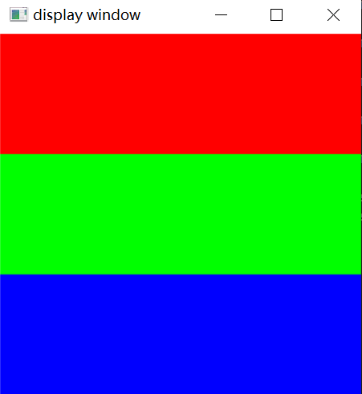

光栅化的过程中涉及到大量的矩阵操作以及将像素转换为图片的操作。对于矩阵运算，采用Eigen矩阵运算库，图像操作采用opencv;

```cpp
//This function is used to convert the pixels' rgb value into opencv::Mat
void write_Mat(cv::Mat& img, std::vector<Eigen::Vector3f>& frame_buf)
{
    int channels = img.channels(), rows = img.rows, cols = img.cols * channels;

    //the Mat may be stored in a one dimension formation
    if (img.isContinuous())
    {
        cols = rows * cols;
        rows = 1;
    }

    uchar* p;
    int idx = 0;
    for (int i = 0; i < rows; ++i)
    {
        p = img.ptr<uchar>(i);
        for (int j = 0; j < cols; j += 3, idx += 1)
        {
            //the value in Mat is not RGB but BGR
            p[j] = frame_buf[idx].z();
            p[j + 1] = frame_buf[idx].y();
            p[j + 2] = frame_buf[idx].x();
        }
    }
}
```

例如对frame_buf中的数值初始化为1/3 red,1/3 blue and 1/3 green

```cpp
int step = height / 3;
    for (int i = 0; i < height; ++i)
    {
        for (int j = 0; j < width; ++j)
        {
            int idx = i * width + j;
            if (i < step)
                frame_buf[idx] = Eigen::Vector3f(255, 0, 0);
            else if (i < 2 * step)
                frame_buf[idx] = Eigen::Vector3f(0, 255, 0);
            else
                frame_buf[idx] = Eigen::Vector3f(0, 0, 255);

        }
    }
```

得到的结果就是：


