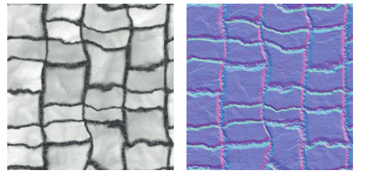
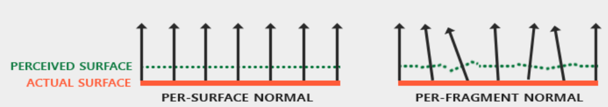
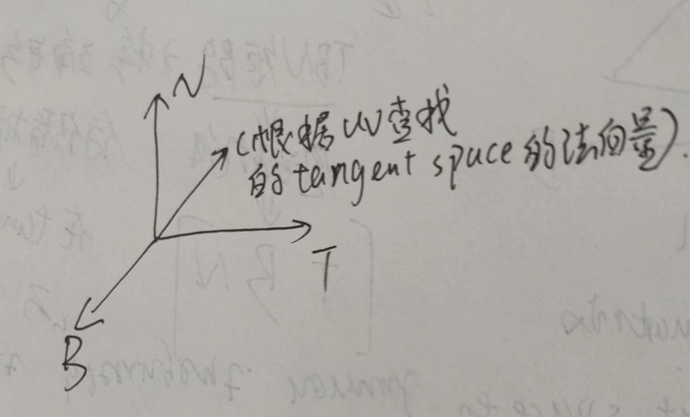
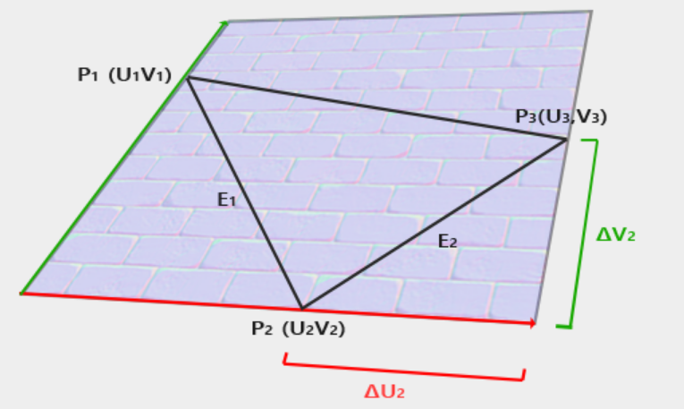
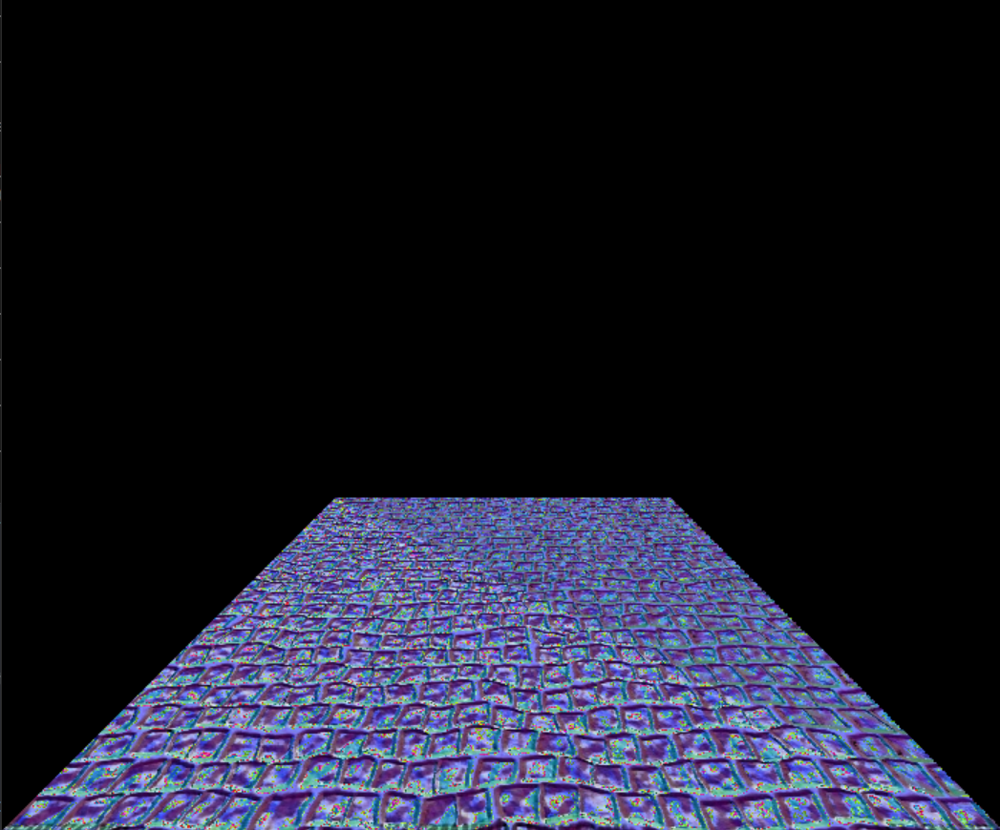

### Normal mapping

参考([LearnOpenGL - Normal Mapping](https://learnopengl.com/Advanced-Lighting/Normal-Mapping) &&Mathematics for 3D Game Programming and Computer Graphics)

法线贴图和凹凸贴图的区别在于：法线贴图存储的是法线，凹凸贴图存储的是相对高度（灰度图），需要通过微分的方法计算法线。关键都是tangent space!



法线贴图是记录triangle mesh上面的每一个fragment 的法向量的大小，在不改变物体表面的几何形状的前提下，通过该改变物体表面的法向量欺骗人眼。



法线贴图的图像通常都是偏蓝色的，因为都是默认法向量的方向是指向z方向，并稍微向x和y方向偏移(接近(0,0,1))，带来的实际问题就是，如果一个triangle mesh的法向量主要方向不是指向z方向，最后的结果就会出错。

解决方法1就是根据每一个triangle mesh的来记录法向量，成千上万个triangle meshes需要大量的hmap.

解决方法2，在vertex上定义一个坐标空间(tangent space)，在该坐标空间中，法向量的朝向总是偏向z方向的。在该坐标空间中根据uv查找法向量的大小，然后通过TBN矩阵转换为world space 或者是camera space中的法向量。

在tagent space 中N为(0,0,1),T 为(1,0,0)，另外一个维度为b(0,1,0)也就是在tangent space 中的正交基。



**目标自然是是将查找到的tangent space中的法向量转换为object space，需要一个3乘3的矩阵也就是TBN矩阵。**

首先是N的推导，tangent space 中的N(0,0,1)需要转换到object space中的vertex的normal:

```math
\begin{bmatrix}
? & ? & normal.x()\\
? & ? & normal.y()\\
? & ? & normal.z()\\
\end{bmatrix}

\times

\begin{bmatrix}
0\\
0\\
1
\end{bmatrix}
=
\begin{bmatrix}
normal.x()\\
normal.y()\\
normal.z()
\end{bmatrix}
```

通过一个特殊值可以求得TBN矩阵中的一列。

同理如果需要推导另外两列的话，需要知道tangent vector 以及bitangent vector在object space 中的坐标。

首先让T坐标轴和u坐标轴对齐，让B坐标轴和v坐标轴对齐。使用该顶点所在的三角形面的三个顶点的坐标以及uv坐标计算T和B在object space 中的大小。



那么：

$$
E_1 = (P2 - P1) = (u2 - u1)T + (v2 - v1)B 
$$

$$
E2 = (P3 - P1) = (u3 - u1)T + (v3  - v1)B
$$

两个方程，求解两个未知数，自然是可以的。

期间展开推导不再赘述，结果就是：

```math
\begin{bmatrix}
T_x & T_y & T_z\\
B_x & B_y & B_z\\
\end{bmatrix}

=


\frac{1}{\Delta U_1 \Delta V_2 - \Delta U_2 \Delta V_1}


\begin{bmatrix}
\Delta V_2 & -\Delta V_1\\
-\Delta U_2 & \Delta U_1
\end{bmatrix}


\begin{bmatrix}
E_{1x} & E_{1y} & E_{1z}\\
E_{2x} & E{2y} & E_{2z}\\
\end{bmatrix}
```

和normal 一样：

```math
\begin{bmatrix}
T & ? & N 
\end{bmatrix}
\times
\begin{bmatrix}
1\\
0\\
0\\
\end{bmatrix} = T
```

由此可以求得TBN 矩阵为：

$$
TBN = [T,B,N]
$$

还有就是RGB映射到法向量的范围[-1,1]以及uv不再垂直需要做斯密特正交化就不再赘述。

```cpp
Eigen::Vector3f rasterizer::normal_mapping_shader(fragment_shader_data* d)
{
	Eigen::Vector3f ka = Eigen::Vector3f(0.005, 0.005, 0.005);
	Eigen::Vector3f kd = Eigen::Vector3f(0.64, 0.64, 0.64);
	Eigen::Vector3f ks = Eigen::Vector3f(0.7937, 0.7937, 0.7937);

	auto l1 = light{ {20, 20, 20}, {1000, 1000, 1000} };
	auto l2 = light{ {-20, 20, 0}, {1000, 1000, 1000} };

	std::vector<light> lights = { l1, l2 };
	Eigen::Vector3f amb_light_intensity{ 10, 10, 10 };
	Eigen::Vector3f eye_pos{ 0, 0, 0 };

	float p = 150;
	Eigen::Vector3f color = d->t->get_color(d->uv.x(), d->uv.y()) / 255.0f;
	Eigen::Vector3f normal = d->normal;
	Eigen::Vector3f point = d->camera_pos;

	Eigen::Vector3f normal_in_tangent_space = d->t->get_color(d->uv.x(), d->uv.y()) / 255.0f;
	Eigen::Vector3f I(1,1,1);
	normal_in_tangent_space = normal_in_tangent_space * 2 - I;
		
	Eigen::Vector3f E1 = d->p2 - d->p1;
	Eigen::Vector3f E2 = d->p3 - d->p1;

	Eigen::Vector2f delta1 = d->uv2 - d->uv1;
	Eigen::Vector2f delta2 = d->uv3 - d->uv1;
	
	float f = 1.0f / (delta1.x() * delta2.y() - delta2.x() * delta1.y());

	Eigen::Vector3f T, B;
	
	T.x() = f * (delta2.y() * E1.x() - delta1.y() * E2.x());
	T.y() = f * (delta2.y() * E1.y() - delta1.y() * E2.y());
	T.z() = f * (delta2.y() * E1.z() - delta1.y() * E2.z());

	B.x() = f * (delta1.x() * E1.x() - delta2.x() * E2.x());
	B.y() = f * (delta1.x() * E1.y() - delta2.x() * E2.y());
	B.z() = f * (delta1.x() * E1.z() - delta2.x() * E2.z());

	Eigen::Matrix3f TBN;
	TBN << T.x(), B.x(), normal.x(),
		T.y(), B.y(), normal.y(),
		T.z(), B.z(), normal.z();
	Eigen::Vector3f bump_normal = TBN * normal_in_tangent_space;
	bump_normal = bump_normal.normalized();

	Eigen::Vector3f result_color = { 0, 0, 0 };
	for (auto& light : lights)
	{


		Eigen::Vector3f light_direction = (light.position - point).normalized();
		Eigen::Vector3f view_direction = (eye_pos - point).normalized();

		auto r_2 = (light.position - point).squaredNorm();

		auto ambient_l = ka.cwiseProduct(amb_light_intensity);

		auto diffuse_l = kd.cwiseProduct(light.intensity / r_2) * std::max(0.0f, light_direction.dot(bump_normal));

		auto h = (light_direction + view_direction).normalized();
		auto specular_l = ks.cwiseProduct(light.intensity / r_2) * std::pow(std::max(0.0f, h.dot(bump_normal)), p);

		result_color += ambient_l + diffuse_l + specular_l;


	}

	Eigen::Vector3f result = { result_color.x() * color.x() * 255.f,result_color.y() * color.y() * 255.f,result_color.z() * color.z() * 255.f };

	return result;
}
```




