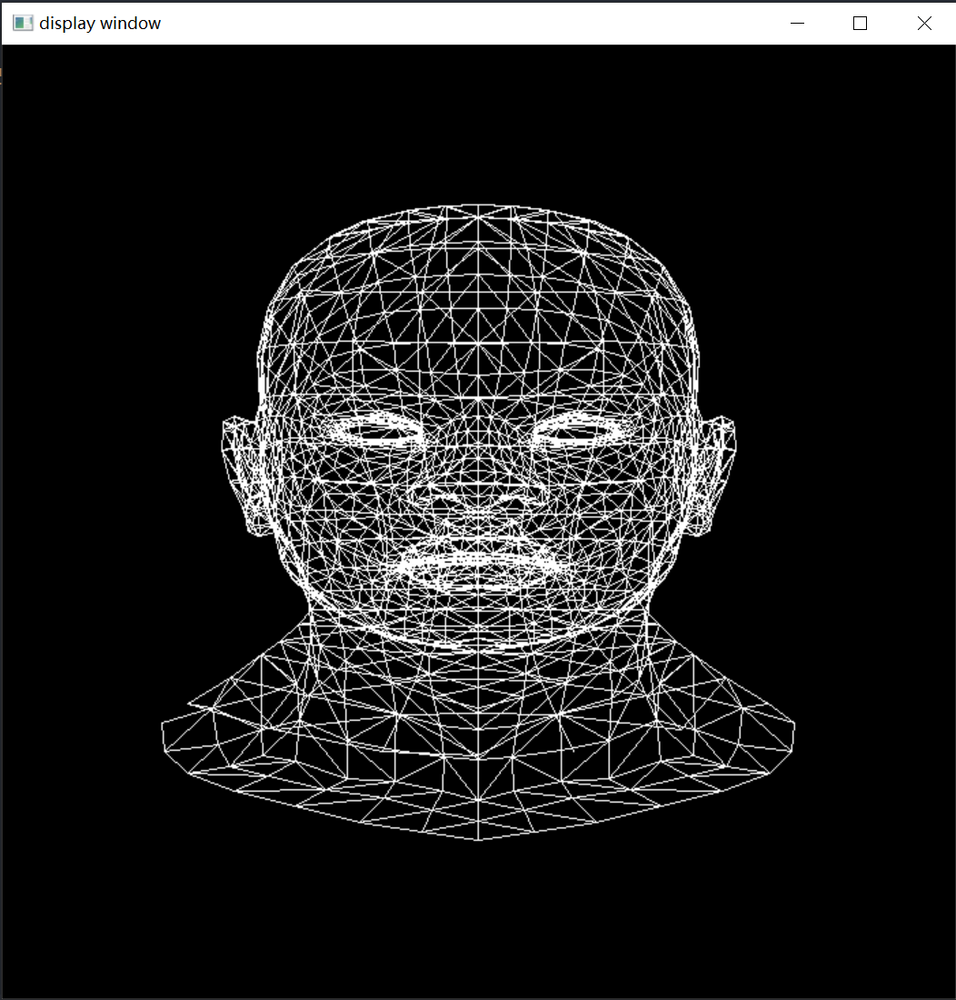
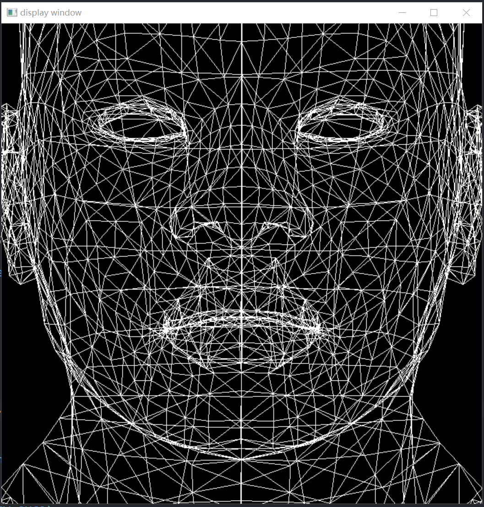
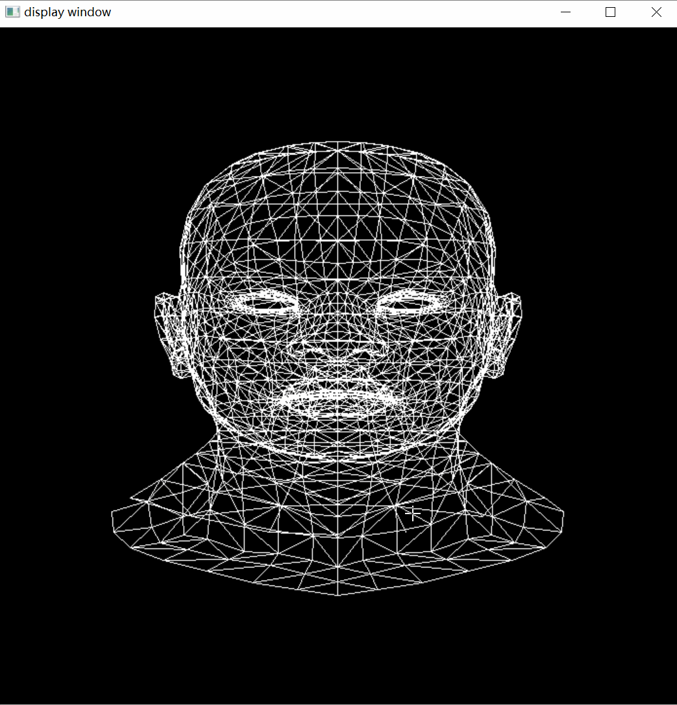

参考了[ssloy/tinyrenderer: A brief computer graphics / rendering course (github.com)](https://github.com/ssloy/tinyrenderer)的模型读取方式，修改为Eigen的向量。

obj文件的格式：

```cpp
v -0.000581696 -0.734665 -0.623267
v 0.000283538 -1 0.286843

vt  0.532 0.923 0.000
vt  0.535 0.917 0.000

vn  0.400 0.338 0.852
vn  0.270 0.126 0.955
vn  0.357 0.433 0.828

f 24/1/24 25/2/25 26/3/26
f 24/1/24 26/3/26 23/4/23
f 28/5/28 29/6/29 30/7/30
```

v：顶点的xyz坐标

vt：纹理坐标

vn：顶点的法向量

f: 一个三角形的顶点index/纹理index/法向量index(从1开始)

**正交投影以及透视投影：之前一直不太理解view volume以及canonical view volume的意义，现在有了一些更加深刻的理解。view volume 实际上定义的是相机可以看到的world space 中的空间范围的大小，因为相机包括人眼实际上看到的范围空间是有限的，例如相机就是透视投影，可以看到的范围就是一个视锥体(通过远平面和近平面以及fov等等定义可视的视锥体的大小)，正交投影的范围是一个axis aligned bounding box，通过定义六个平面的参数确定。也就是world space 中的物体并不是都能够投影到二维平面上的，得在view volume 中的物体才能够被投影到二维平面上面。同时view volume是自定义的，也就是看到多少物体实际上是自定义的。**

为什么突然有感呢？刚刚尝试在写正交投影，简单啊，直接扔掉z坐标，留下xy坐标，但是xy坐标太小了，肯定不能作为screen space中的坐标，得做一个view port transformation,但是要做view port transformation得知道二维平面的大小以及screen的大小，xy坐标二维的大小呢？实际上就是自定义的，能够看到多少的范围。标准做法是：view volume -> canonical view volume -> view port transformation -> screen space.

实际上投影到canonical view volume也是为了方便对不在view volume空间中的三角形进行clipping，也被成为clipping space。

```cpp
模型边界取值范围：
-0.66248 0.66248
-1 1
-0.675105 0.675105
```

那orthographic view volume的定义可以是[-1,1] && [-1.5,1.5] && [-1,1]

$$
M_{otho} =
\begin{bmatrix}
\frac{2}{r-l} & 0 & 0 & 0 \\
0 & \frac{2}{t-b} & 0 & 0 \\
0 & 0 & \frac{2}{n-f} & 0\\
0 & 0 & 0 & 1\\
\end{bmatrix}
\times
\begin{bmatrix}
1 & 0 & 0 & -\frac{l+r}{2}\\
0 & 1 & 0 & -\frac{b + t}{2}\\
0 & 0 & 1 & -\frac{n + f}{2}\\
0 & 0 & 0 & 1 
\end{bmatrix}
$$

之后做view port transformation:将canonical view volume 转换为 screen space 中的坐标。[-1,-1] * [-1,1] -> [-0.5,width - 0.5] * [-0.5,height - 0.5],先放大后平移

$$
\begin{bmatrix}
x_{screen}\\
y_{screen}\\
1
\end{bmatrix} = 
\begin{bmatrix}
\frac{width}{2} & 0 & \frac{width-1}{2}\\
0 & \frac{height}{2} & \frac{height-1}{2}\\
0 & 0 & 1\\
\end{bmatrix}
\begin{bmatrix}
x_{canonical}\\
y_{canonical}\\
1
\end{bmatrix}
$$

通过正交投影可以生成的图像：



如果修改正交投影的view volume的大小，使得并不能够包围整个头像，也就是[-0.5,0.5] && [-0.5,-0.5] && [-0.5.0.5]，得到的结果是：



可以看到确实是不能看到整个模型了，只能看到部分模型，虽然模型上面的点是真实存在的并且也是通过正交变化以及view port transformation，不过并不在axis aligned abounding box中的线段经过变换之后会超过屏幕空间坐标的表示范围，也就是最后并不能被看到，因此将view volume理解为可视范围也是ok的。当然得对frame_buf做一个越界判断(直接修改view volume会导致vector越界)

通过model transformation 可以实现简单的绕y轴旋转：按键A和D控制。由于没有visibility的检测，旋转180度看起来和正面是一样的。


