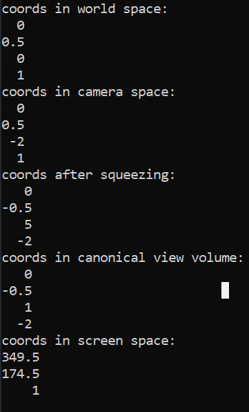

### 正交投影的实现：


(图源：虎书)

总体来说就是以上四个变换，一般称为MVP变换，其中view transformation 也被称为camera transformation. Model transformation 以及 viewport transformation 和正交投影并无区别。主要实现camera transformation 以及 projection transfromation.

#### camera transformation

定义相机的位置：

1. gaze at direction g

2. up direction t

3. position e

为了后续的计算方便，一般是需要将相机放在预先设定的参数：

1. gaze at direction -z

2. up direction y

3. 原点

相机的三个参数可以任意设定，按照任意轨迹运动，通过camera transformation可以将相机放到预先设定的位置，并且将world space 转换为 camera space.

这里为了简化相机的参数设置，假设相机已经看向-z方向，并且up direction已经是+y方向，并且只是在z轴上面运动，也就是[0,0,camera_pos];

那么camera transformation的变换矩阵为：

$$
M_{camera} = 
\begin{bmatrix}
1 & 0 & 0 & 0\\
0 & 1 & 0 & 0\\
0 & 0 & 1 & -camera\_pos\\
0 & 0 & 0 & 1\\
\end{bmatrix}
$$

#### perspective transformation

期间省略一堆数学推导和推理(码不动了)，可以参考games101。

$$
M_{persp} = M_{ortho} M_{persp -> ortho}
$$

$$
M_{otho} =
\begin{bmatrix}
\frac{2}{r-l} & 0 & 0 & 0 \\
0 & \frac{2}{t-b} & 0 & 0 \\
0 & 0 & \frac{2}{n-f} & 0\\
0 & 0 & 0 & 1\\
\end{bmatrix}
\times
\begin{bmatrix}
1 & 0 & 0 & -\frac{l+r}{2}\\
0 & 1 & 0 & -\frac{b + t}{2}\\
0 & 0 & 1 & -\frac{n + f}{2}\\
0 & 0 & 0 & 1 
\end{bmatrix}
$$

$$
M_{persp -> ortho} =
\begin{bmatrix}
n & 0 & 0 & 0\\
0 & n & 0 & 0\\
0 & 0 & n+f & -nf\\
0 & 0 & 1 & 0\\
\end{bmatrix}
$$

**实现时需要注意的是近平面n和远平面f的大小关系啊！比如看向-z的话，近平面n是要比远平面f要大的。为什么需要注意这个呢？主要是在正交投影矩阵的放缩部分有一个2/(n-f),其中的n-f表示的是长度，必须得是正的，也就是得确保是大 - 小。**

还有l ,r 以及b,t 是如何定义的？这里的l,r以及b,t是定义在近平面上的，从推导过程中可以知道是先从视锥体将远平面挤压到和近平面大小相同，得到一个长方体，再对长方体进行一次正交投影，那么自然l,r以及b,t是定义在近平面上的。

不过更加常用的定义是fovY(field-of-view)以及aspect ratio.

$$
tan(\frac{fovY}{2}) = \frac{t}{|n|}
$$

$$
aspect\_ratio = \frac{r}{t}
$$

**emm,接下来我得怎样定义这个视锥体使得能够包围整个模型或者说场景呢？当然随心定义应该也没啥问题，能看到什么就不好说了，不过多试试就知道能不能看全了。**

首先是定义相机的位置：(0,0,2)

然后估计一下视锥体的参数吧！

```cpp
模型边界取值范围：
-0.66248 0.66248
-1 1
-0.675105 0.675105
```

经过camera transformation 之后在camera space 中，xy的范围还是不变的，z轴的范围变为[-2.6,-1.4]，那么可以视锥体可以定义为

n = -1, f = -3, aspect_ratio = 1, fov = 90度；                                                                                                                                                              

实现起来也没啥：

```cpp
Eigen::Vector3f transformation::perform_perspective_projection(const Eigen::Vector3f& vertx)
{
    Eigen::Vector4f homo_coords(vertx.x(), vertx.y(), vertx.z(), 1.0f);

    Eigen::Vector4f canonical_coords = pers_projection * camera_transformation * model_transformation * homo_coor            ds;
    //depth value is not used now so ignore it
    Eigen::Vector3f xy1(canonical_coords.x(), canonical_coords.y(), 1.0f);

    Eigen::Vector3f screen_coords = view_port_transformation * xy1;

    return screen_coords;
}
```

```cpp
void rasterizer::render_wire_frame_perspective_projection()
{
    int faces = _ptr_m->nfaces();

    for (int i = 0; i < faces; i++)
    {
        std::vector<int> f = _ptr_m->face(i);
        Eigen::Vector3f vertx1 = _ptr_m->vert(f[0]);
        Eigen::Vector3f vertx2 = _ptr_m->vert(f[1]);
        Eigen::Vector3f vertx3 = _ptr_m->vert(f[2]);

        //std::cout << vertx1.x() << " " << vertx1.y() << std::endl;
        //std::cout << vertx2.x() << " " << vertx2.y() << std::endl;
        //std::cout << vertx3.x() << " " << vertx3.y() << std::endl;

        Eigen::Vector3f s1 = trans.perform_perspective_projection(vertx1);
        Eigen::Vector3f s2 = trans.perform_perspective_projection(vertx2);
        Eigen::Vector3f s3 = trans.perform_perspective_projection(vertx3);

        Eigen::Vector2i p1((int)s1.x(), (int)s1.y());
        Eigen::Vector2i p2((int)s2.x(), (int)s2.y());
        Eigen::Vector2i p3((int)s3.x(), (int)s3.y());
        //std::cout << p1.x() << " " << p1.y() << std::endl;
        //std::cout << p2.x() << " " << p2.y() << std::endl;
        //std::cout << p3.x() << " " << p3.y() << std::endl;

        draw_line(p1, p2);
        draw_line(p2, p3);
        draw_line(p3, p1);
    }
}
```

结果就是：


好家伙，又又又颠倒过来了。。。。自己写的每一行代码可以狠狠把握住了！

和opencv y轴向下并无关系！在线段绘制的时候已经解决了！

首先在world space 中模型必然是正的，从正交投影中就可以知道，正交投影是将整个模型压缩到canonical view volume ，然后将canonical view volume放大到和screen space 大小相同，然后丢弃掉z轴将模型投影到二维的屏幕上面，这个过程中模型并没有旋转，最后的结果也是正的，也就是world space中的模型必然是正的。

其次在camera space 中模型必然也是正的，因为camera transformation 实际上是平移操作，向-z方向平移两个标准单位。

最后的view port transformation 也是不会导致模型发生颠倒的，因为view port transformation 说白了就是将canonical view volume scale 到和screen相同的大小。

问题出现在perspective projection 上面。

推导perspective projection 的过程中是分为两步的，首先是将视锥体压缩成长方体的view volume ,然后是将长方体的view volume 通过正交投影的方式转换到canonical space,根据上面的讨论可知，正交投影的这个过程并不会旋转模型。

所以最后问题出现在将视锥体压缩成view volume的过程中。

```cpp
Eigen::Vector3f vertx1(-0.5,0,0);
Eigen::Vector3f vertx2(0.5,0,0);
Eigen::Vector3f vertx3(0,1,0);

Eigen::Vector3f s1 = trans.perform_perspective_projection(vertx1);
Eigen::Vector3f s2 = trans.perform_perspective_projection(vertx2);
Eigen::Vector3f s3 = trans.perform_perspective_projection(vertx3);

Eigen::Vector2i p1((int)s1.x(), (int)s1.y());
Eigen::Vector2i p2((int)s2.x(), (int)s2.y());
Eigen::Vector2i p3((int)s3.x(), (int)s3.y());

draw_line(p1, p2);
draw_line(p2, p3);
draw_line(p3, p1);
```

尝试画一个三角形，其中verx3是在y轴上面的：


追踪一下vertx3的坐标变化：



可以看到从squeezing之后y的方向确实变了，emmm推导过程中的问题在哪呢？动不了一点脑子了，先搁着吧，直接乘于一个矩阵变回来吧。


-----

update : 我知道为什么会颠倒过来了！！！！

在写图形渲染管线的时候才忽然发现漏了很重要的一步：homogenius division!

在MVP变换的过程中:

model transformation -> camera transformation -> squeezing -> homogenius division(/w) -> orthographic projection -> viewport transformation

在写图形渲染管线将homogenius division 加上去之后：


图像又颠倒过来了，我才意识到公式的推导是完全没有问题的！是我漏了一个homogenius division!


